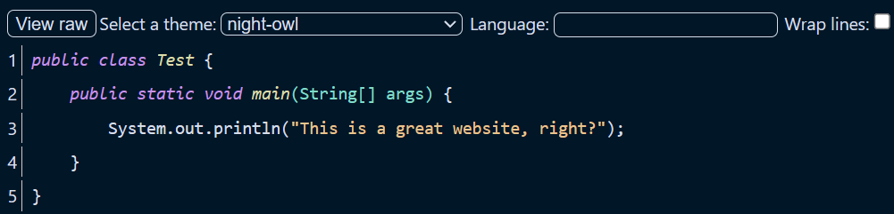
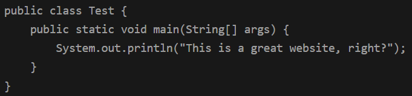
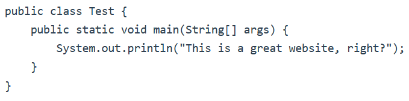

# file-preview
A static website intended to be used for viewing text files from URLs.  
This website was made primarily to be used by Discord mobile users to be able to see code files shared in chat (the mobile app does not have in-app file previews, unlike the desktop one).
## Dependencies
This website depends on a CORS proxy because some hosts do not add CORS headers to responses.
## Usage
In order to use this website simply append the URL of the file you want to view as a URL search parameter (`?url=<url>`).  
The website provides syntax highlighting of a few popular languages via [highlight.js](https://highlightjs.org/). A highlighting language will be attempted to be detected from the URL extension (`https://explamle.com/somefile.TXT`) and if one can't be detected highlight.js will attempt to detect it based on the contents. You may change the language in the input box at the top of the page.  
A raw view is also provided by appending the `raw` parameter to the URL or by using the `View raw` button at the top of the page.  
Additionally, the theme can be changed from the dropdown at the top of the page. The theme will be persisted in [local storage](https://developer.mozilla.org/en-US/docs/web/api/window/localstorage). The default theme is `night-owl`.
## Hosting
While you can self-host this website, a public instance hosted through GitHub Pages is available at https://filepreview.matyrobbrt.com/.

## Screenshots
A previewed Java file:

Raw view in dark mode:

Raw view in light mode:
